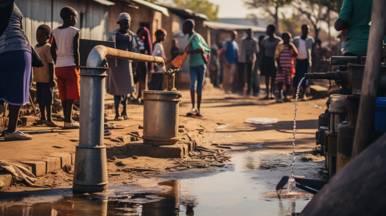
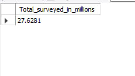
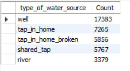
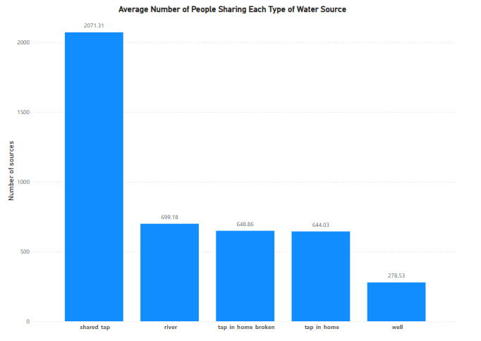
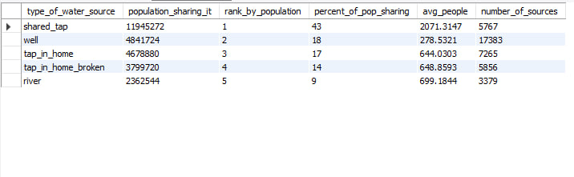
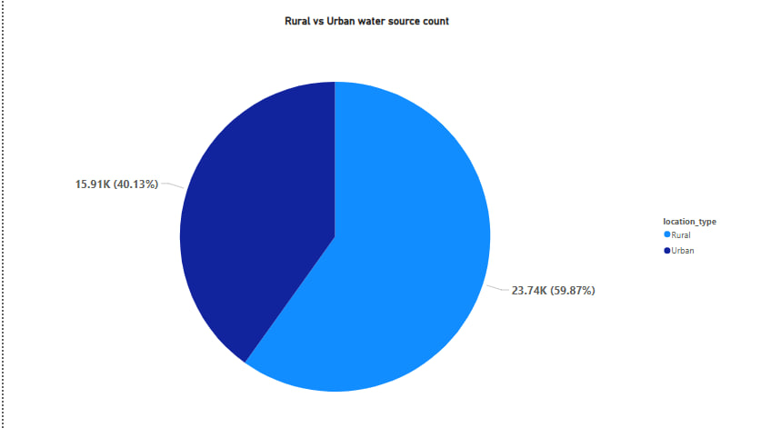
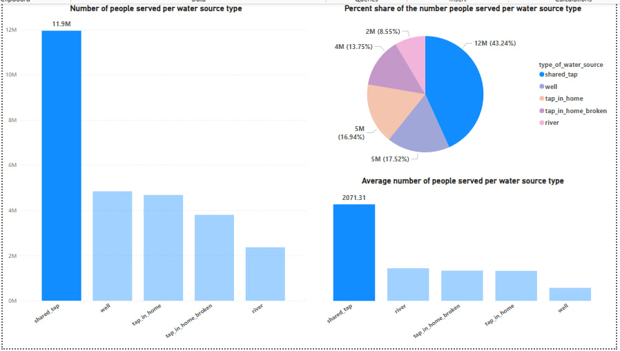
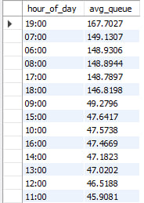
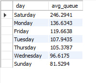

# MD Water Services: A Data Analysis Using SQL and Power BI  
*By Wondirad Abebe Kifelew*  

---

---

### 🌍 **Project Overview**  

This analysis explores access to water sources in **Maji Ndogo**, a hypothetical place using a mock survey dataset.  
The goal is to understand the population's dependency on different water sources and identify patterns in usage so that a better infrastructure could be built while using resources effectively and efficiently.  

SQL was used for querying and cleaning the dataset. Visualizations were created using **Power BI**, which can be found in the *Visualizations* directory for a more comprehensive report.  

---

### 📂 **Dataset Description**  

The dataset consists of three tables within the `md_water_services` schema:
- `water_source`
- `location`
- `visits`

---

### 📊 **Analysis Questions & SQL Queries with Results**

---

#### 1. 💡 Total Number of People Surveyed (in Millions)  

```sql
SELECT 
    SUM(number_of_people_served) / 1000000 AS Total_surveyed_in_millions 
FROM 
    md_water_services.water_source;
```  


---

#### 2. 🧾 Count of Each Water Source Type (Well, Tap, River, etc.)

```sql
SELECT 
    type_of_water_source, 
    COUNT(*) AS Count 
FROM 
    md_water_services.water_source 
GROUP BY 
    type_of_water_source;
```  


---

#### 3. 👥 Average Number of People Sharing Each Type of Water Source

```sql
SELECT 
    type_of_water_source, 
    AVG(number_of_people_served) AS Avg_people_served 
FROM 
    md_water_services.water_source 
GROUP BY 
    type_of_water_source;
```  


---

#### 4. 📈 Total Population by Water Source Type & Rank

```sql
SELECT 
    type_of_water_source, 
    SUM(number_of_people_served) AS population_sharing_it, 
    RANK() OVER (ORDER BY SUM(number_of_people_served) DESC) AS rank_by_population, 
    ROUND(SUM(number_of_people_served) / 276000) AS percent_of_pop_sharing, 
    AVG(number_of_people_served) AS avg_people, 
    COUNT(*) AS number_of_sources 
FROM 
    md_water_services.water_source 
GROUP BY 
    type_of_water_source;
```  


---

#### 5. 🏘️ Number of Water Sources in Rural vs Urban Areas

```sql
SELECT 
    location_type, 
    COUNT(location_id) AS count 
FROM 
    md_water_services.location  
GROUP BY 
    location_type;
```  


---

#### 6. 🚰 Shared Taps Show Staggering Numbers



---

#### 7. ⏳ Queue Waiting Times  

**7.1 Average Waiting Time**

```sql
SELECT 
    AVG(NULLIF(time_in_queue, 0)) AS avg_queue_time 
FROM 
    md_water_services.visits;
```  


---

**7.2 Queue Time by Hour of the Day**

```sql
SELECT 
    TIME_FORMAT(TIME(time_of_record), '%H:00') AS hour_of_day, 
    AVG(time_in_queue) AS avg_queue 
FROM 
    md_water_services.visits 
GROUP BY 
    hour_of_day 
ORDER BY 
    avg_queue DESC;
```  


---

**7.3 Queue Time by Day of the Week**

```sql
SELECT 
    DAYNAME(time_of_record) AS day, 
    AVG(NULLIF(time_in_queue, 0)) AS avg_queue 
FROM 
    md_water_services.visits 
GROUP BY 
    DAYNAME(time_of_record) 
ORDER BY 
    avg_queue DESC;
```  


---

### 📌 Key Insights & Findings

- A total of **27.63 million** people were surveyed across all water sources.  
- The most common water source is **wells**, serving **17.52%** of the population.  
- **Wells and taps** tend to serve more people on average than rivers or springs.  
- A large population relies on a **small number of highly shared** water sources.  
- Most water sources are located in **rural areas**.  
- **43%** of the population uses **shared taps**—around **2,000 people** share a single tap.  
- Citizens experience **long queue times** (averaging over **120 minutes**):
  - Queues are **longest on Saturdays**.
  - **Mornings and evenings** are peak times.
  - **Wednesdays and Sundays** have the **shortest queues**.

---

### 📢 Recommendations

- **Prioritize improving shared taps** —benefits will scale to large groups.  
- Recommend deploying **mobile water tanks** or temporary staff on peak days (like Saturdays).
- Build water tankers and hire people so they can fill the tankers in shortest queue times like mid days to shorten the queue time in the 
 evening  
- Since most sources are in **rural regions**, infrastructure teams should prepare for **logistical challenges** (road access, labor, and supply chains).

---

### 📬 Contact

**For collaboration, feedback, or job opportunities:**  
📧 Email: wondiradabebekifelew@gmail.com  
📞 Phone: +251-976045777  
