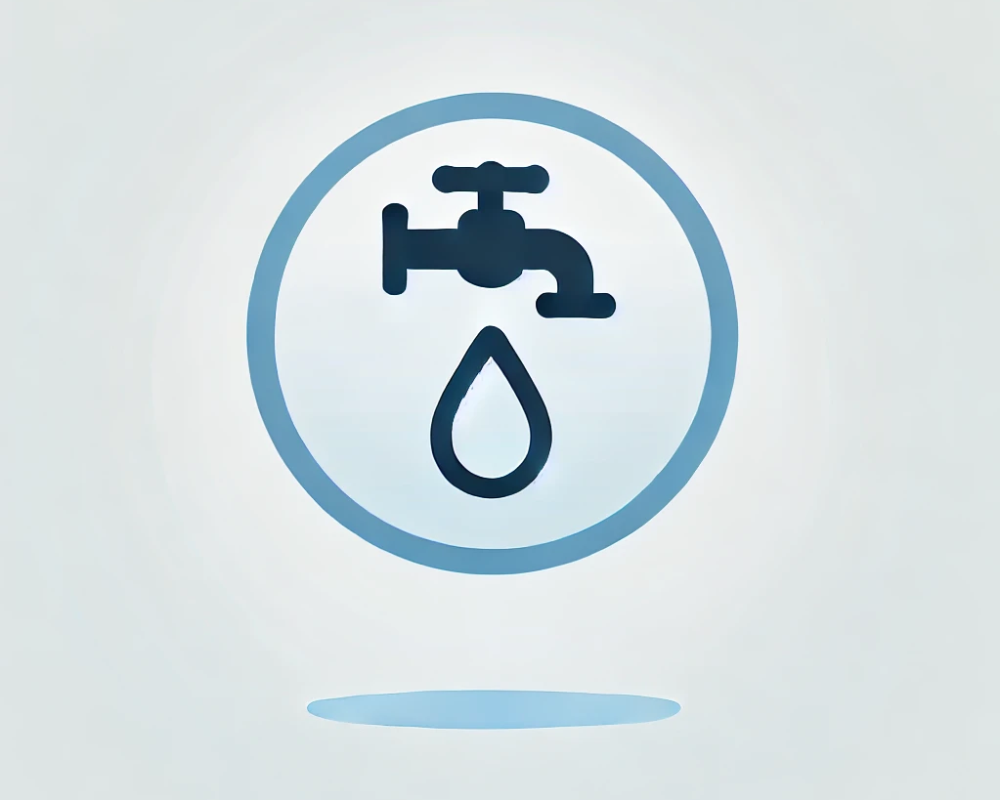
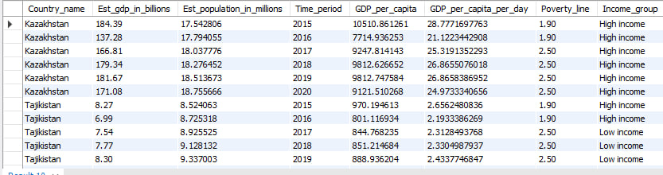
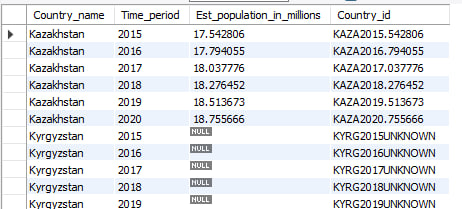
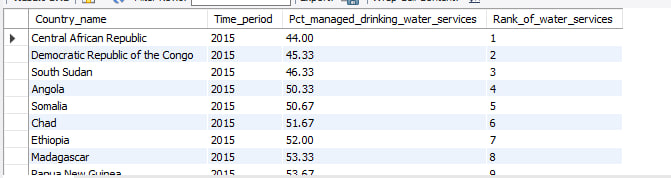
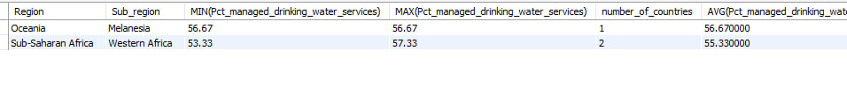
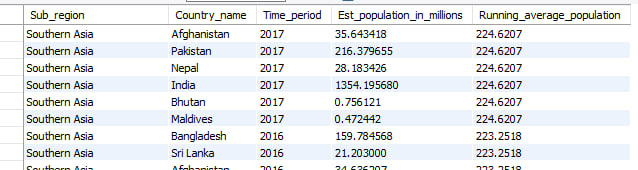
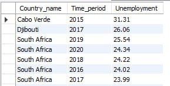
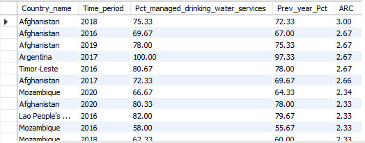

# United Nations: Access to Basic Services (SQL Analysis)

*By Wondirad Abebe Kifelew*

---

---

### 🌍 **Project Overview**

This project analyzes access to basic services, focusing on water availability, population demographics, and unemployment trends from 2015-2020 in key regions. It highlights regions with critical challenges and aims to provide actionable insights for targeted interventions and policy recommendations.

The goal is to:

- Provide insights into water access issues.
- Explore the socio-economic impact of high population densities.
- Address unemployment spikes in Central and South Eastern Asia and Sub-Saharan Africa.
- Recommend targeted interventions and policies based on findings.
  
---
This analysis was performed using **SQL** to extract insights..

---

### 📂 **Dataset Description**

The analysis uses a single table called `access_to_basic_services` from the `united_nations` database, which includes:

- GDP estimates  
- Population data  
- Water service availability  
- Unemployment rates  
- Time period and regional info

---

### 📊 **Analysis Questions & SQL Queries with Results**

---

#### 1. 💰 GDP per Capita and Poverty Classification

```sql
SELECT
    Country_name,
    Est_gdp_in_billions,
    Est_population_in_millions,
    Time_period,
    (Est_gdp_in_billions / Est_population_in_millions) * 1000 AS GDP_per_capita,
    (Est_gdp_in_billions / Est_population_in_millions) * (1000 / 365.25) AS GDP_per_capita_per_day,
    IF(Time_period < 2017, 1.90, 2.50) AS Poverty_line,
    CASE
        WHEN (Est_gdp_in_billions / Est_population_in_millions) * (1000 / 365.25) < IF(Time_period < 2017, 1.90, 2.50) THEN 'Low income'
        WHEN (Est_gdp_in_billions / Est_population_in_millions) * (1000 / 365.25) > IF(Time_period < 2017, 1.90, 2.50) THEN 'High income'
        ELSE 'Middle income'
    END AS Income_group
FROM
    united_nations.access_to_basic_services
WHERE
    Est_gdp_in_billions IS NOT NULL;
```



---

### 2. 🔢 Assigning Unique ID for Countries
```
SELECT
    DISTINCT Country_name,
    Time_period,
    Est_population_in_millions,
    CONCAT(
        SUBSTRING(IFNULL(UPPER(Country_name), 'UNKNOWN'), 1, 4),
        SUBSTRING(IFNULL(Time_period, 'UNKNOWN'), 1, 4),
        SUBSTRING(IFNULL(Est_population_in_millions, 'UNKNOWN'), -7)
    ) AS Country_id
FROM
    united_nations.access_to_basic_services;
```



---


### 3. 🏆 Water Services Rank by Country and Year(From worst to best)
```
SELECT
    Country_name,
    Time_period,
    Pct_managed_drinking_water_services,
    RANK() OVER (PARTITION BY Time_period ORDER BY Pct_managed_drinking_water_services) AS Rank_of_water_services
FROM
    united_nations.access_to_basic_services;
```



---


### 4. 📉 Sub-regions with Low Water Access & GDP Ranking
```
SELECT
    Region,
    Sub_region,
    MIN(Pct_managed_drinking_water_services),
    MAX(Pct_managed_drinking_water_services),
    COUNT(DISTINCT Country_name) AS number_of_countries,
    AVG(Pct_managed_drinking_water_services),
    SUM(Est_gdp_in_billions) AS Sum_Est_gdp_in_billions
FROM
    united_nations.access_to_basic_services
WHERE
    Time_period = 2020
    AND Pct_managed_drinking_water_services < 60
GROUP BY
    Region, Sub_region
HAVING
    number_of_countries < 4
ORDER BY
    Sum_Est_gdp_in_billions;
```



---


### 5. 👥 Running Average of Population by Sub-region
```
SELECT
    Sub_region,
    Country_name,
    Time_period,
    Est_population_in_millions,
    ROUND(AVG(Est_population_in_millions) OVER (
        PARTITION BY Sub_region
        ORDER BY Time_period
    ), 4) AS Running_average_population
FROM
    united_nations.access_to_basic_services
WHERE
    Est_population_in_millions IS NOT NULL;
```



---


### 6. 📉 Unemployment in Key Regions
```
SELECT
    Country_name,
    Time_period,
    IFNULL(Pct_unemployment, 19.3) AS Unemployment
FROM
    united_nations.access_to_basic_services
WHERE
    Region LIKE "%Central and Southern Asia%"
    OR Region LIKE "%Sub-Saharan Africa%";
```



---


### 7. 🔁 Access Rate Change (ARC) of Drinking Water
```
SELECT
    Country_name,
    Time_period,
    Pct_managed_drinking_water_services,
    LAG(Pct_managed_drinking_water_services, 1) OVER(PARTITION BY Country_name ORDER BY Time_period) AS Prev_year_Pct,
    Pct_managed_drinking_water_services - LAG(Pct_managed_drinking_water_services) OVER(PARTITION BY Country_name ORDER BY Time_period) AS ARC
FROM
    united_nations.access_to_basic_services;
```



---


### 📌 Key Insights
- Countries like Central African republic, DRC, and South Sudan have the lowest access to basic water services(<50%) across the years 2015 to 2020
- Afganistan showed highest improvement in Access rates to basic water services in the years 2018, 2016 and 2019 from their respective previous years
- Despite the presence of countries with smaller populations like Maldives and Bhutan in south asia, the average population remains high, due to massive populations in the region such as India, Pakistan, and Bangladesh
- countries like cappeverde in 2015, djibouti in 2017 and south africa in 2019 showed highest unimployement rates.
  
  ---

### 📢 Recommendations
- Focus infrastructure and aid efforts on low-access subregions with <4 countries.
- Develop employment projects in Sub-Saharan Africa and Southern Asia.
- Identify best practices in countries showing consistent improvement in water access like Afganistan(2016-2019).
- Focus on improving water access in countries like Central African Republic, DRC, and South Sudan.
- Consider population-weighted policies in South Asia, factoring in large countries like India, Pakistan, and Bangladesh.

  ---

###  📬 Contact
** For collaboration, feedback, or job opportunities: **
📧 Email: wondiradabebekifelew@gmail.com
📞 Phone: +251-976045777
